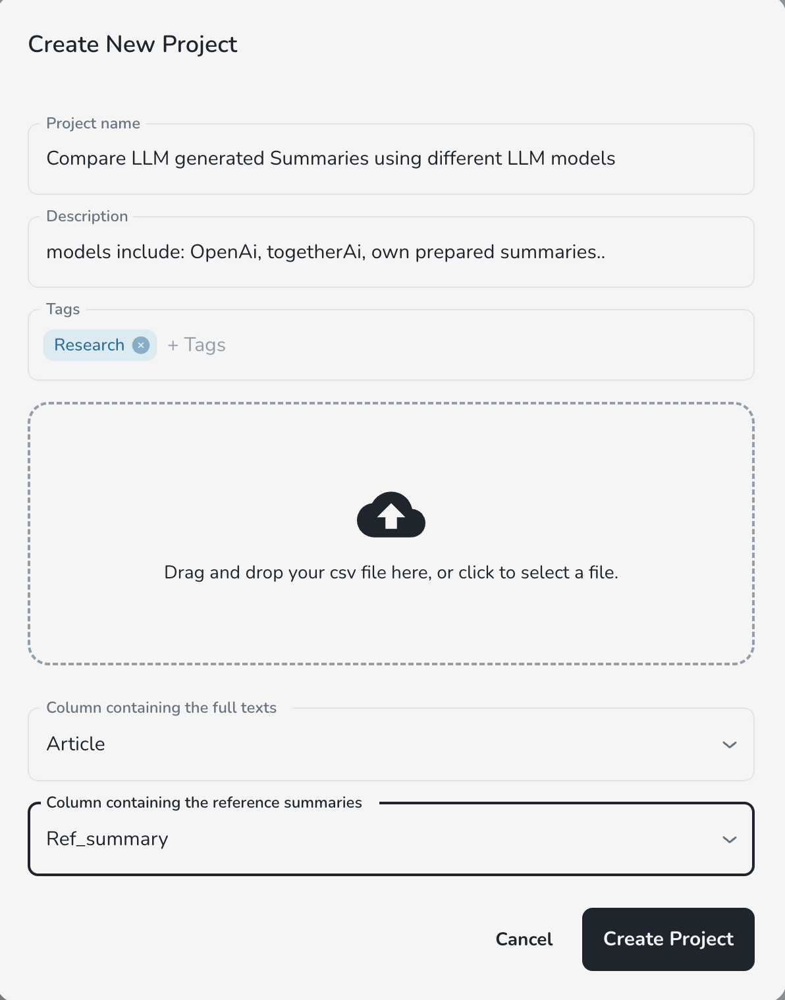

## Project Overview

### App Name  
**SummEval**  

### Description  
SummEval is a free tool designed for **researchers and annotators** to obtain both auto-generated scores and human feedback on **LLM-generated summaries**. By uploading your experiments, you can evaluate the quality of your summaries, compare them against other models, and gain insights into performance across different domains. SummEval provides a user-friendly **dashboard** that allows you to monitor, manage, and compare multiple experiments efficiently.



### Purpose  
SummEval was created to **bridge the gap between human evaluation and automated summarization metrics**. While automated metrics like ROUGE and BERTScore provide quick assessments, they often fail to capture nuanced human preferences. SummEval allows researchers to:  
- Gather **human feedback** on summary quality.  
- **Compare multiple models** across different domains.  
- Gain insights into **performance trends** through an intuitive **dashboard**.  
- Improve their **LLM-generated summaries** based on real-world human evaluations.  

## Features

SummEval provides a comprehensive evaluation platform for **LLM-generated summaries**, offering a range of functionalities for both researchers and annotators.

### Key Features  
- **Create Projects** – Organize your evaluation tasks by creating distinct projects for different research domains.  
- **Create Experiments** – Upload and manage experiments to compare different summarization models.  
- **Automated Summarization Metrics** – Once an experiment is created, automatic evaluation metrics (e.g., ROUGE, BERTScore) are generated for quick assessments.  
- **Human Evaluation Surveys** – Researchers can launch surveys and invite annotators to assess generated summaries using various qualitative metrics.  
- **Sentence Highlighting** – Annotators can highlight specific sentences in generated summaries to enhance the clarity and accuracy of evaluation results.  
- **View Results** – Analyze the results through a user-friendly dashboard to compare model performance and gain insights.  

### Unique Functionalities  
- **Seamless Human & Automated Evaluation** – Combines human feedback with standard automated summarization metrics.  
- **Domain-Specific Model Comparisons** – Enables comparison of models across different domains for a deeper performance analysis.  
- **Intuitive Dashboard** – Provides a clear, organized view of all experiments and their evaluations.  

## Technologies Used

SummEval is built using a modern tech stack to ensure efficiency, scalability, and seamless user experience.

### Core Technologies:
- **Python**  – Main programming language for backend development.  
- **Django**  – Web framework for building the backend and API services.  
- **React**  – Frontend framework for building the user interface.  
- **PostgreSQL**  – Database system for storing and managing structured data.  
- **OpenAI API**  – Used for generating summaries and fact scores in evaluation.  
- **Hugging Face**  – Supports NLP models and evaluation metrics.  
- **Redis**  – In-memory data store used for caching and message brokering.  
- **Celery**  – Asynchronous task queue for handling background tasks efficiently. 
- **Docker**  – Containerization platform for managing and deploying the application in isolated environments.  


These technologies work together to provide a smooth and efficient evaluation system for summarization research.


## Installation

Follow these steps to set up and run SummEval in your local development environment.

### Prerequisites  
Ensure you have the following installed on your system:  
- [Docker](https://www.docker.com/)  
- [Docker Compose](https://docs.docker.com/compose/)  

### Setup Instructions  

1. **Add Environment Variables**  
   - Create a `.env` file inside the `backend/summeval` directory.  
   - Configure the required environment variables in the `.env` file.
   - Please request the .env file by emailing to anumafzaldogar@gmail.com

2. **Build the Docker Containers**  
   ```sh
   docker compose build
3. **Run the Application**  
   ```sh
   docker compose up

## Configuration

SummEval requires environment variables for proper setup. Ensure you configure the necessary API keys and settings in the `.env` file.

### Environment Variables  

Open `.env` file under `backend/summeval` and add the following variables:

OpenAI API Key for generating fact scores: If the usage limit is exceeded, update the OPENAI_API_KEY with a new valid key in the .env file.

OPENAI_API_KEY=<your_openai_api_key>

The .env files should also be updated with database credential. These can be obtained by contacting the owner of this repository.


## Database Migrations

If you encounter migration issues while setting up or modifying the database, follow these steps to ensure a smooth migration process.

### Resolving Migration Issues in Django

1. **Ensure there is no existing migration folder** under `./backend/base`:
   ```sh
   rm -rf backend/base/migrations
2. **Check that Django is not detecting any migrations**:
   ```sh
   python manage.py showmigrations base
3. **Create the migrations folder and an initial migration based on the current models and database tables**:
   ```sh
   python manage.py makemigrations base
4. **Apply the initial migration using the --fake-initial flag to tell Django that the tables already exist**:
   ```sh
   python manage.py migrate base --fake-initial
### Modifying Models & Applying New Migrations
1. **Modify your Django models as needed.** 
2. **Create a new migration file for the changes**:
   ```sh
   python manage.py makemigrations base
3. **Apply the migration**:
   ```sh
   python manage.py migrate base --fake-initial
**By following these steps, you can prevent migration conflicts and ensure database schema consistency.**

## Deployment

SummEval is deployed on **Hetzner**, and the following steps outline how to connect to the server, build, and run the application.

### Steps to Deploy on Hetzner  

1. **Generate an SSH key** (if you haven't already):  
   ```sh
   ssh-keygen -t ed25519 -C "your email"
2. **Add the SSH key to Hetzner to allow secure access.**
3. **Connect to the Hetzner server:**:
   ```sh
   ssh root@<Hetzner_server_ip>
4. **Add the SSH key to GitLab to enable secure repository access.**
5. **Clone the project and switch to the desired branch**:
   ```sh
   git clone <repository_url>
   git checkout <branch_name>
5. **Transfer the .env file to the server**:
   ```sh
   scp -i ~/.ssh/id_ed25519 <path_to_local_env_file> root@<Hetzner_server_ip>:<server_env_path>
6. **Run the application using Docker Compose**:
   ```sh
   docker compose up -d
## Contact

If you have any questions or encounter any issues, please raise the issues or contact us at:  

📧 **Email:** [anum.afzal@tum.de](mailto:anum.afzal@tum.de)


